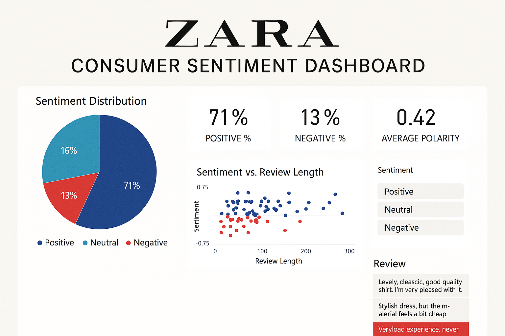

**Zara Consumer Sentiment Dashboard**

**Objective**  
Analyse Zara customer reviews using Natural Language Processing (NLP) to uncover sentiment patterns, key insights, and visualise them with interactive Power BI dashboards.

**Tools Used**  
- Python (TextBlob, Pandas)  
- Power BI  
- CSV / Excel  
- Data Visualisation & KPI Metrics

**Project Steps**

1. Data Collection
   Collected 500+ real Zara reviews from open sources.

2. Sentiment Analysis (Python)
   - Used `TextBlob` to compute `polarity` scores.
   - Classified reviews as Positive, Negative, or Neutral.
   - Calculated review length for deeper insights.

3. Dashboard Creation (Power BI)  
   - Imported enriched dataset (`zara_reviews_with_sentiment.csv`)
   - Created:
     - Pie Chart: Sentiment distribution
     - Scatter Plot: Sentiment vs. Review Length
     - KPI Cards: Positive %, Negative %, Average Polarity
     - Slicer: Filter by sentiment
     - Review table for deep dive

**Key Insights**

- 71% Positive sentiment shows strong brand satisfaction.
- Negative reviews are mostly concerned with delivery or sizing.
- Longer reviews had more emotional extremes.
- Dashboard allows dynamic filtering for live insights.

**Files in This Repo**

- `zara_reviews_with_sentiment.csv` → Cleaned + labeled review data  
- `Zara_Consumer_Sentiment_Dashboard.pbix` → Interactive dashboard  
- `Dashboard_Preview.png` → Visual preview of output  
- `README.md` → Project explanation

**Use Cases**

- Marketing: Track consumer satisfaction trends  
- Customer Experience: Identify pain points  
- Analytics Portfolio: Demonstrates real-world NLP + BI skills

**How to Use**

1. Clone/download this repo
2. Open CSV in Power BI (or use `.pbix` file)
3. Filter, analyze, export reports

**zara-sentiment-dashboard**
Sentiment analysis of Zara reviews using Python (TextBlob) + Power BI interactive dashboard
